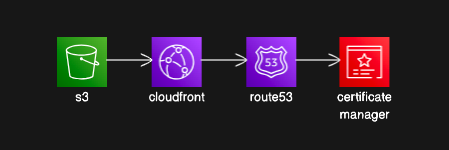
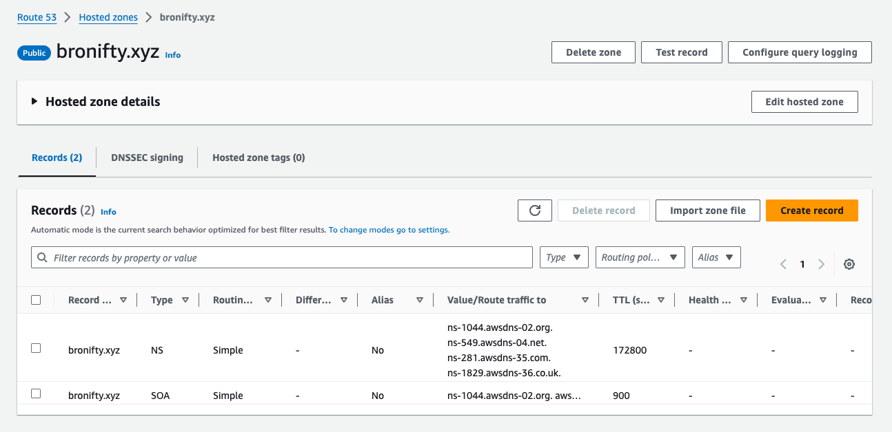
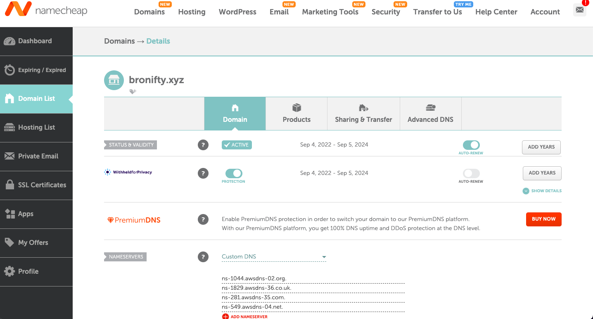
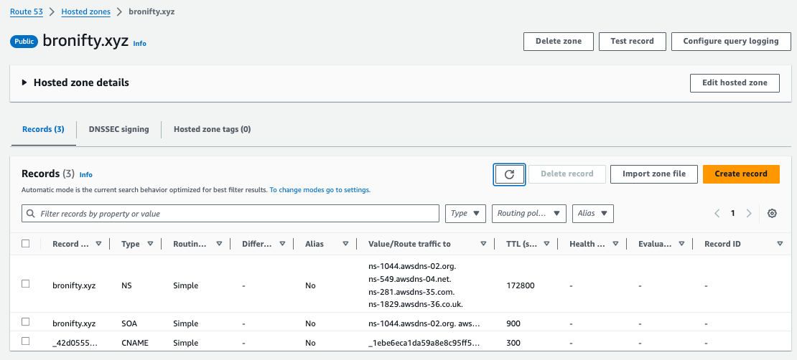
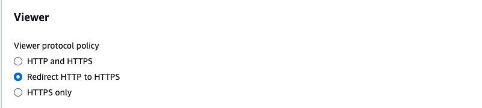
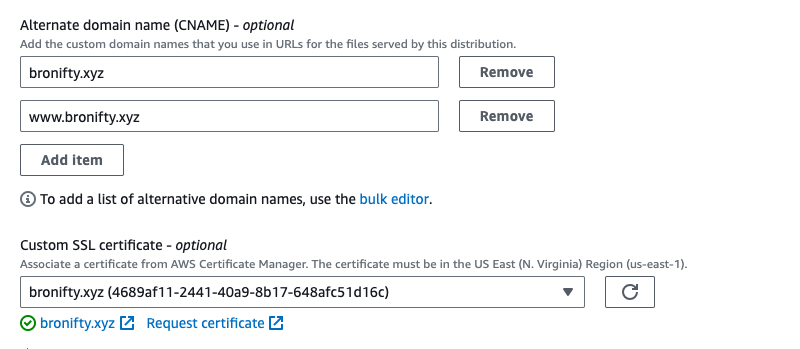
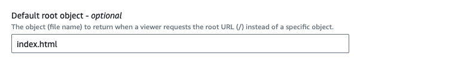
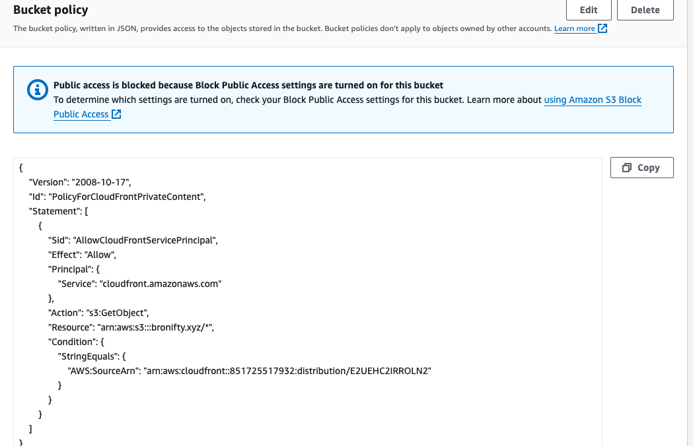
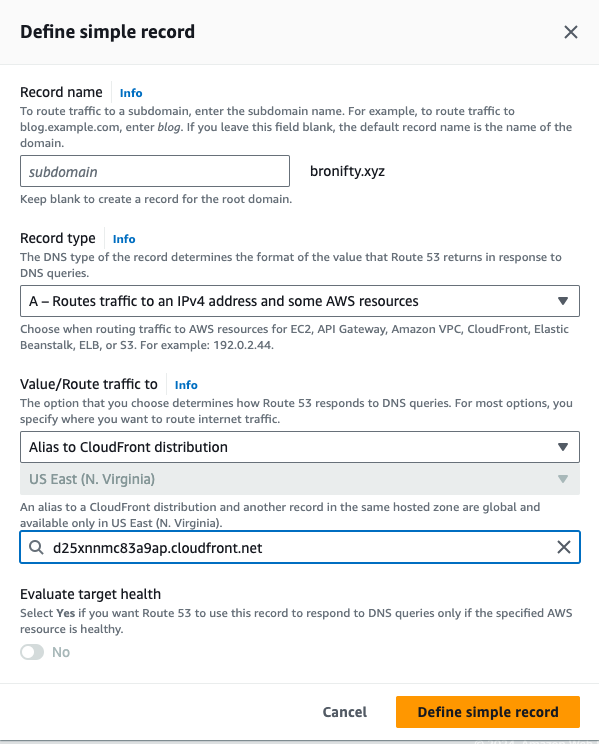
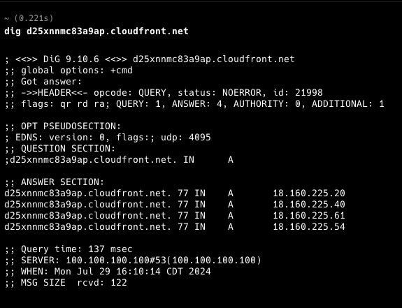

# S3 Bucket Website Protected and Cached With Cloudfront CDN and Route 53 DNS

:::tip{title="Synopsis:"}

We will start with Route 53 and Certificate Manager to handle domain control with SSL/TLS certificates and then set up the bucket as an origin for a cloudfront distribution which will serve traffic back through DNS.

:::

This is what our system architecture will look like:



## Route 53

Create a hosted zone for your apex domain and point your domain registrar's nameservers to Route 53.





## Certificate Manager

Request a public certificate for your apex and wildcard subdomain with DNS validation and RSA 2048. Then click create records in Route 53 and acknowledge for the validation (click "create records" in subsequent window). Then view cert success and route 53 CNAME record.




:::tip{title="Milestone:"}

All set. let's create our bucket and cloudfront distribution to point the DNS A record to it and get a domain name for your website.

:::

## S3 Bucket

Create a bucket with default properties (block all public access and static web hosting disabled) and drop your static assets in there (eg., with index.html in the root, which we will specify as the root object later in the distribution settings). Once that is set, we will create a distribution pointing to the bucket as origin and circle back to update the bucket policy with something similar to this (only the bucket and distribution arns will change).

```json
{
  "Version": "2008-10-17",
  "Id": "PolicyForCloudFrontPrivateContent",
  "Statement": [
    {
      "Sid": "AllowCloudFrontServicePrincipal",
      "Effect": "Allow",
      "Principal": {
        "Service": "cloudfront.amazonaws.com"
      },
      "Action": "s3:GetObject",
      "Resource": "arn:aws:s3:::bronifty.xyz/*",
      "Condition": {
        "StringEquals": {
          "AWS:SourceArn": "arn:aws:cloudfront::851725517932:distribution/E2UEHC2IRROLN2"
        }
      }
    }
  ]
}
```

## Cloudfront Distribution

Create a distribution with your bucket as origin and create an origin access control (OAC) to send signed headers (authentication) to access the private bucket.

:::warning

Keep all other default settings and customize the following parameters:

- redirect http to https
- cnames and cert (from cert manager step above)
- default root object to index.html

:::








Once you create the distribution, follow the bucket policy update flow by copying the policy and navigating to the bucket to update it.


On the permissions tab of the bucket, edit the policy and paste from your clipboard.



Now follow your distribution's domain to your protected website (only this cloudfront can access it with its signed aka authenticated headers).


:::tip{title="Milestone:"}

All set. let's point the DNS A record to this distribution and get a domain name for your website.

:::

## DNS Resolution to Cloudfront Distribution

In Route 53, create a simple A (ip address) record to point your apex domain to your cloudfront distribution.



:::danger{title="t-shoot"}

This will point your domain name to the ip address of the cloudfront distribution and we will check it with `dig` to verify. This is also where you can t-shoot the dns resolution.

:::

Define another A record to redirect to the apex domain's record.


:::warning

Typically the redirect is done with a CNAME record, but Route 53 is handling it differently.

:::

## T-Shoot

Validate programmatically and t-shoot the result with dig. Let's make sure our apex and subdomain point to the distribution's ip address.




:::tip{title="Milestone:"}

All set. Open your site in a cognito window so it won't be cached.

:::
